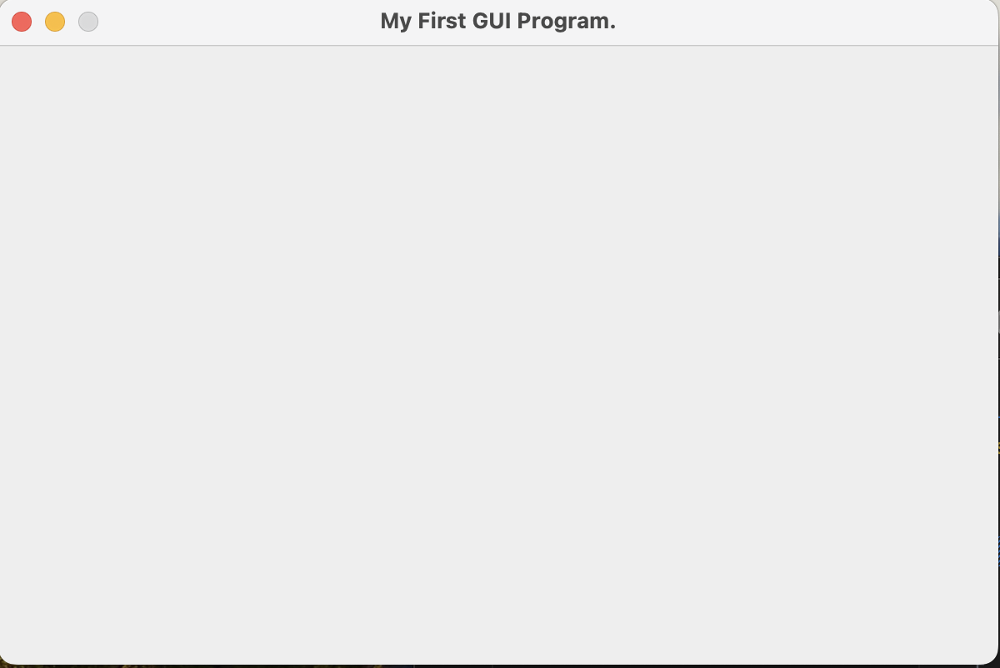

# Basic GUI Program using JFrame

**Name**: Basic GUI Program using JFrame

**Date**: July 10th, 2024

## Source Code

```java
package Assignment1.QuestionNo1;

import javax.swing.*;
import java.util.logging.*;

public class Display {
    // Create a logger instance
    private static final Logger logger = Logger.getLogger(Display.class.getName());

    public static void main(String[] args) {
        logger.info("Starting the application...");

        // Create the frame
        JFrame frame = new JFrame();
        frame.setTitle("My First GUI Program.");
        frame.setSize(600, 400);
        frame.setResizable(false);
        frame.setDefaultCloseOperation(JFrame.EXIT_ON_CLOSE);

        // Log a message indicating that the frame has been created
        logger.info("Frame created with title: " + frame.getTitle());

        // Make the frame visible
        frame.setVisible(true);

        // Log a message indicating that the frame is now visible
        logger.info("Frame is now visible.");
    }
}
    ```

## Output


