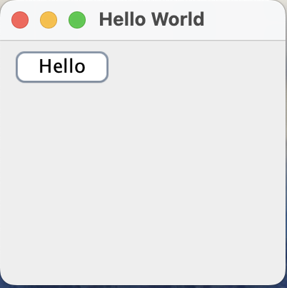

# GUI Program for implementing custom Button named Hello

**Name**: GUI Program for implementing custom button named Hello

**Date**: July 15th, 2024

## Source Code

```java
package QuestionNo3;

import java.awt.FlowLayout;
import javax.swing.*;

public class HelloWorld {
    public static void main(String[] args) {
        JFrame frame = new JFrame("Hello World");
        JPanel panel = new JPanel(new FlowLayout(FlowLayout.LEFT));
        JButton btn = new JButton("Hello");
        
        panel.add(btn);
        
        frame.add(panel);
        frame.setSize(200,200);
        frame.setDefaultCloseOperation(JFrame.EXIT_ON_CLOSE);
        frame.setLocationRelativeTo(null);
        frame.setVisible(true);
    }    
}
```

## Output


