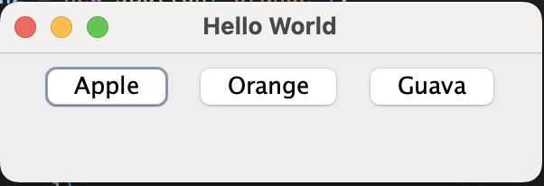

# GUI Program for displaying three buttons having fruits name on it.

**Name**: GUI Program for displaying three buttons having fruits name on it.

**Date**: July 20th, 2024

## Source Code

```java
package QuestionNo4;

import javax.swing.*;
import java.awt.*;

public class buttons {
    public static void main(String[] args) {
        JFrame frame = new JFrame("Hello World");

        JPanel panel = new JPanel(new FlowLayout(FlowLayout.CENTER));
        JButton btn1 = new JButton("Apple");
        JButton btn2 = new JButton("Orange");
        JButton btn3 = new JButton("Guava");
        
        panel.add(btn1);
        panel.add(btn2);
        panel.add(btn3);
        frame.add(panel);
        
        frame.setSize(300, 100);
        frame.setDefaultCloseOperation(JFrame.EXIT_ON_CLOSE);
        frame.setLocationRelativeTo(null);
        frame.setVisible(true);
    }
}

```

## Output


