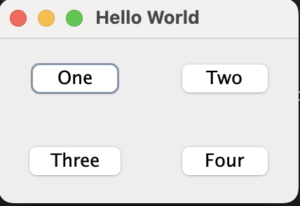

# GUI Program for displaying four buttons using gridbag layout.

**Name**: GUI Program for displaying four buttons using gridbag layout.

**Date**: July 22th, 2024

## Source Code

```java
package QuestionNo5;

// import java.awt.GridBagConstraints;
// import java.awt.GridBagLayout;
// import java.awt.Insets;
import java.awt.*;
import javax.swing.*;

public class ButtonLayout {
    public static void main(String[] args) {
        JFrame frame = new JFrame("Hello World");
        JPanel panel = new JPanel(new GridBagLayout());

        JButton btn1 = new JButton("One");
        JButton btn2 = new JButton("Two");
        JButton btn3 = new JButton("Three");
        JButton btn4 = new JButton("Four");

        GridBagConstraints gbc = new GridBagConstraints();
        gbc.insets = new Insets(15, 15, 15, 15);

        gbc.gridx = 0;
        gbc.gridy = 0;
        panel.add(btn1, gbc);

        gbc.gridx = 1;
        gbc.gridy = 0;
        panel.add(btn2, gbc);

        gbc.gridx = 0;
        gbc.gridy = 1;
        panel.add(btn3, gbc);

        gbc.gridx = 1;
        gbc.gridy = 1;
        panel.add(btn4, gbc);

        frame.add(panel);
        frame.pack();
        frame.setDefaultCloseOperation(JFrame.EXIT_ON_CLOSE);
        frame.setLocationRelativeTo(null);
        frame.setVisible(true);
    }    
}
```

## Output


