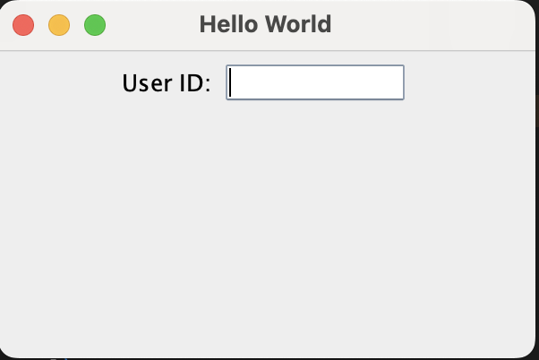

# GUI Program for displaying a Textbox asking for UserID.

**Name**: GUI Program for displaying a Textbox asking for UserID.

**Date**: July 24th, 2024

## Source Code

```java
package Assignment1.QuestionNo6;

import javax.swing.*;

public class DisplayUserID {
    public static void main(String[] args) {
        JFrame frame = new JFrame("Hello World");
        JPanel panel = new JPanel();
        
        frame.setDefaultCloseOperation(JFrame.EXIT_ON_CLOSE);
        frame.setSize(300, 200);
        
        JLabel label = new JLabel("User ID:");
        JTextField textField = new JTextField(8);
        
        panel.add(label);
        panel.add(textField);
        frame.add(panel);
        frame.setLocationRelativeTo(null);
        frame.setVisible(true);
    }
}
```

## Output


